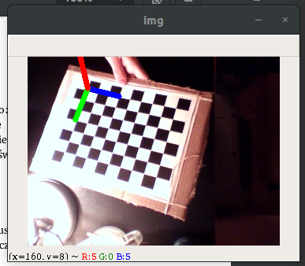

\newpage

# O projekcie

Celem projektu było stworzenie oprogramowania wraz z infrastrukturą pozwalającą na obróbkę obrazu pochodzącego ze źródła nie połączonego fizycznie z komputerem. Jest to sposób na ułatwienie testowania aplikacji AR. Konieczność wykorzystywania kamery natywnej laptopa, bądź podłączonej do niego bezpośrednio przewodem powoduje szereg problemów, głównie związanych z koniecznością obecności w pobliżu kamery. Dzięki wykorzystaniu RaspberryPi z podłączoną doń kamerą, oraz komunikacją WiFi ograniczenia te znikają i pozwalają na przyspieszenie prac. Stworzono zabezpieczenie w postaci *fallbacku* do kamery połączonej bezpośrednio z komputerem, przez co nie są tworzone inne niedogodności. Do przyspieszenia prac stworzono również skrypty pomocnicze.

## Wykorzystany sprzęt i technologie

Do wykonania założonych zadań wykorzystano:

 * Hardware
    - RaspberryPi 3B+
    - kamera USB
 * Software
    - język Python3
    - język Bash
    - technologię TCP Socket
    - bibliotekę Zero MQ
    - bibliotekę OpenCV
    - bibliotekę NumPy

## Architektura


Projekt można podzielić na 2 sekcje: serwerową oraz kliencką. Zadaniem pierwszej jest stworzenie serwera Socket, a po połączeniu się klienta - przesyłanie sygnału wideo z kamery, oraz ewentualnie wstępna obróbka obrazu przed wysłaniem. Każdy kadr przed wysłaniem jest konwertowany do kodowania base64, a po odebraniu dekodowany z pomocą biblioteki NumPy.

Klient ma połączyć się z serwerem, odebrać strumień wideo, obróbka obrazu z pomocą OpenCV i wyświetlenie go użytkownikowi.

Do komunikacji wykorzystano bibliotekę ZeroMQ, która poprzez sockety przesyła obraz.

Skrypty pomocnicze zostały napisane w języku Bash, natomiast komunikacyjne i związane z obróbką obrazu w języku Python.

# Realizacja

## Drzewo projektu

```
.
|-- connect_rpi.sh
|-- dist.txt
|-- docs
|   |-- architecture.png
|   |-- missfont.log
|   |-- sprawozdanie.md
|   `-- sprawozdanie.pdf
|-- find_rpi.sh
|-- mtx.txt
|-- process_stream.py
|-- read_stream.py
`-- start_stream.py
```

## Opis plików

Opis pomniejszych plików i katalogów:

 * `docs` - folder zawierający pliki związane z dokumentacją
 * `mtx.txt` - plik tekstowy z macierzą kamery USB użytej w projekcie
 * `dist.txt` - plik tesktowy z macierzą zniekształceń kamery USB użytej w projekcie

### `find_rpi.sh`

```{.bash .numberLines caption="Poszukiwanie RaspberryPi w podsieci"}
#!/bin/bash

arp -a | awk '/b8:27:eb/{ print substr($2, 2, length($2)-2); exit; }'
```
Skrypt zwraca pierwsze znalezione IP urządzenia RaspberryPi. Na początku pobierane są wszystkie urządzenia w podsieci za pomocą komendy `arp-a`. Następnie każda zwrotka (jedna zwrotka = 1 urządzenie w podsieci) jest przeszukiwana na obecność ciągu znaków `b8:27:eb`, który to znajduje się w adresie MAC każdego RPI. Następnie z lini zawierającej wspomniany ciąg znaków "wyciągany" jest adres IP, a następnie wysyłany do strumienia wyjścia.

### `connect_rpi.sh`

```{.bash .numberLines caption="Poszukiwanie i połączenie z RaspberryPi przez ssh"}
#!/bin/bash
# ssh_rpi:
#   Connect to first found RaspberryPi device


PROGNAME=$(basename $0)
error_exit() {
	echo -e "\e[1m\e[31mError (${PROGNAME}): ${1:-"Unknown Error"}" 1>&2
	exit 1
}

echo -e "\e[33mSearching for RaspberryPi Devices...\e[0m"
ip=$(./find_rpi.sh)

if [ ! -z "$ip" ]
    then
    if ping -c1 -W1 -q $ip &>/dev/null
        then
        echo -e "\e[32mFound $ip\e[0m"
        echo -e "\e[32mConnecting to RPI\n\e[0m"
        ssh pi@$ip
        else
            error_exit "RaspberryPi cannot be connected"
    fi
    else
        error_exit "RaspberryPi cannot be found on local network"
fi
```

Skrypt wykorzystuje komendy z poprzedniego podrozdziału do znalezienia urządzenia. Ponieważ jednak jest możliwość, że znalezione IP jest cachowane, tj. może zostać znalezione urządzenie, które było dostępne kilka minut wcześniej, ale już nie jest. Z tego powodu przeprowadzany jest test pingowania urządzenia, a po jego zdaniu popełniana jest próba połączenia poprzez protokół SSH jako użytkownik `pi`.

### `start_stream.py`

```{.python .numberLines caption="Poszukiwanie i połączenie z RaspberryPi przez ssh"}
#!/usr/bin/env python3

import base64
import cv2
import socket
import zmq

cap = cv2.VideoCapture(0)  # init the camera
context = zmq.Context()
footage_socket = context.socket(zmq.PUB)
footage_socket.bind('tcp://0.0.0.0:5555')

print("Starting stream")
while True:
    try:
        grabbed, frame = cap.read()  # grab the current frame
        frame = cv2.resize(frame, (320, 240))  # resize the frame
        encoded, buffer = cv2.imencode('.jpg', frame)
        jpg_as_text = base64.b64encode(buffer)
        footage_socket.send(jpg_as_text)

    except KeyboardInterrupt:
        print("Exception raised! Exiting...")
        cap.release()
        cv2.destroyAllWindows()
        break
```
Stream uruchamiany jest na porcie `5555` dla wszystkich interfejsów sieciowych urządzenia. Tworzony jest obiekt `VideoCapture` biblioteki OpenCV, który następnie, w nieskończonej pętli, pobiera kadr z kamery, enkoduje do standardu base64 i wysyła poprzez API biblioteki ZeroMQ. W razie błędów obiekt kamery jest zwalniany, przez możliwe jest ponowne uruchomienie skryptu bez konieczności dodatkowego zwalniania urządzenia. Kadr jest zmniejszany do rozmiaru 320x240px, aby zapewnić płynność transmisji.

### `read_stream.py`

```{.python .numberLines caption="Skrypt odbierający obraz ze strumienia i wyświetalający go"}
#!/usr/bin/env python3

import cv2
import zmq
import socket
import base64
import sys
import getopt
import numpy as np


class Stream(object):
    def __init__(self, host="127.0.0.1", port=5555):
        addr = "tcp://{}:{}".format(host, port)
        print("Connecting to socket: {}".format(addr))
        try:
            self.context = zmq.Context()
            self.footage_socket = self.context.socket(zmq.SUB)
            self.footage_socket.connect(addr)
            self.footage_socket.setsockopt_string(zmq.SUBSCRIBE, np.unicode(''))
        except Exception:
            print("Cannot connect to socket!")

    def read(self):
        try:
            frame = self.footage_socket.recv_string()
            img = base64.b64decode(frame)
            npimg = np.fromstring(img, dtype=np.uint8)
            source = cv2.imdecode(npimg, 1)
            return True, source
        except Exception:
            return False, None

def help_print():
    print('./read_stream.py -i <ip> -p <port>')
    sys.exit()

if __name__ == "__main__":
    kwargs = {}

    try:
        opts, args = getopt.getopt(sys.argv[1:], "hi:p:", ["ip=", "port="])
    except getopt.GetoptError:
        help_print()
    
    for opt, arg in opts:
        if opt == '-h':
            help_print()
        elif opt in ("-i", "--ip"):
            kwargs["host"] = arg
        elif opt in ("-p", "--port"):
            kwargs["port"] = arg


    s = Stream(**kwargs)
    while True:
        try:
            cv2.imshow("Stream", s.read()[1])
            cv2.waitKey(1)
        
        except KeyboardInterrupt:
            cv2.destroyAllWindows()
            break
```

Skrypt zawiera klasę `Stream`, która pozwala w łatwy sposób pobrać obraz ze strumienia. Do konstrukora podać można 2 opcjonalne argumenty - `host` oraz `port`, które definiują adres serweru socket. Ustawienie tychże parametrów jest możliwe z linii poleceń za pomocą opcji `-i` oraz `p`, bądź `ip=`, `port=`.

Obraz pobierany jest poprzez methodę `read`. Dla autora ważne było, aby nazwa metod była tożsama z tymi obiektu `VideoCapture` z OpenCV, przez co możliwe jest łatwe zmienianie źródła obrazu.

Jeśli skrypt wywoływany jest z linii poleceń, uruchamiana jest pętla pobierają obraz ze streamu i wyświetlająca go bez żadnych modyfikacji. Służy to przetestowaniu poprawności transmisji.

### `process_stream.py`

```{.python .lineNumbers caption="Skrypt odbierający obraz ze strumienia i transformujący go"}
#!/usr/bin/env python3

import sys
import getopt
import requests
import cv2
import numpy as np
import read_stream


# termination criteria
criteria = (cv2.TERM_CRITERIA_EPS + cv2.TERM_CRITERIA_MAX_ITER, 30, 0.001)

# Load camera matrix and distortions matrix
mtx = np.loadtxt('mtx.txt')
dist = np.loadtxt('dist.txt')

# prepare object points, like (0,0,0), (1,0,0), (2,0,0) ....,(8,6,0)
objp = np.zeros((7*9, 3), np.float32)
objp[:, :2] = np.mgrid[0:9, 0:7].T.reshape(-1, 2)

# prepare axis
axis = np.float32([[3, 0, 0], [0, 3, 0], [0, 0, -3]]).reshape(-1, 3)

FPS = int(1000/60)


### Functions

def draw(img, corners, imgpts):
    corner = tuple(corners[0].ravel())
    img = cv2.line(img, corner, tuple(imgpts[0].ravel()), (255, 0, 0), 5)
    img = cv2.line(img, corner, tuple(imgpts[1].ravel()), (0, 255, 0), 5)
    img = cv2.line(img, corner, tuple(imgpts[2].ravel()), (0, 0, 255), 5)
    return img

def read_video(cap):
    while(True):
        # Capture frame-by-frame
        ret, img = cap.read()
        if img is not None:
            # Display the resulting frame
            # cv2.imshow('img', img)
            gray = cv2.cvtColor(img, cv2.COLOR_BGR2GRAY)
            # cv2.imshow('img', gray)
            ret, corners = cv2.findChessboardCorners(gray, (9, 7), flags=cv2.CALIB_CB_FAST_CHECK)

            if ret is True:
                corners2 = cv2.cornerSubPix(gray, corners, (11, 11), (-1, -1), criteria)

                # Find the rotation and translation vectors.
                ret, rvecs, tvecs, _ = cv2.solvePnPRansac(objp, corners2, mtx, dist)

                # project 3D points to image plane
                imgpts, jac = cv2.projectPoints(axis, rvecs, tvecs, mtx, dist)
                img = draw(img, corners2, imgpts)
                cv2.imshow('img', img)
            else:
                cv2.imshow("img", img)

            # Press q to close the video windows before it ends if you want
            cv2.waitKey(FPS)
        else:
            print("Frame is None")
            break

def help_print():
    print('./process_stream.py -i <ip> -p <port>')
    sys.exit()


if __name__ == "__main__":
    kwargs = {}

    try:
        opts, args = getopt.getopt(sys.argv[1:], "hi:p:", ["ip=", "port="])
    except getopt.GetoptError:
        help_print()
    
    for opt, arg in opts:
        if opt == '-h':
            help_print()
        elif opt in ("-i", "--ip"):
            kwargs["host"] = arg
        elif opt in ("-p", "--port"):
            kwargs["port"] = arg


    s = read_stream.Stream(**kwargs)
    read_video(s)
```

Podobnie jak w poprzednim podrozdziale, możliwe jest opcjonalne podanie hosta oraz portu serwera socketu. Skrypt pobiera obraz ze strumienia i modyfikuje go wedle wskazówek.

Zawartość skryptu zmienia się i związana jest bezpośrednio ze stanem zaawansowania pracy magisterskiej autora. Powyższy skrypt wykorzystuje kadry do znalezienia na nim szachownicy o rozmiarze `9x11`, wyliczenie jej orientacji w przestrzeni, narysowanie w rogu szachownicy układu współrzędnych i wyświetlenie ostatecznego efektu użytkownikowi. Proces wykrywania i wyznaczania orientowacji i położenia szachownicy, oraz rysowanie linii na kadrze realizowane jest za pomocą funkcji biblioteki OpenCV.



## Raspberry Pi

Skrypt `start_stream.py` za pomocą `crontab` został ustawiony jako skrypt uruchamiany od razu po starcie systemu, dlatego też do rozpoczęcia strumieniowania konieczne jest jedynie podłączenie zasilania do urządzenia.

Jedyną sytuacją w której wymagana jest manualna ingerencja w urządzenie jest połączenie z nową sieciową WiFi.

Skrypt w systemie urządzenia umieszczony jest w `/var/stream_video/main.py`. Strumień wyjściowy skryptu zapisywany jest w pliku `logs.log`, dzięki czemu możliwe jest debuggowanie w razie problemów.